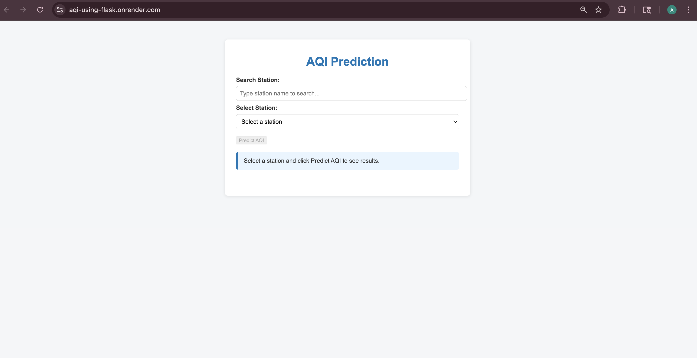
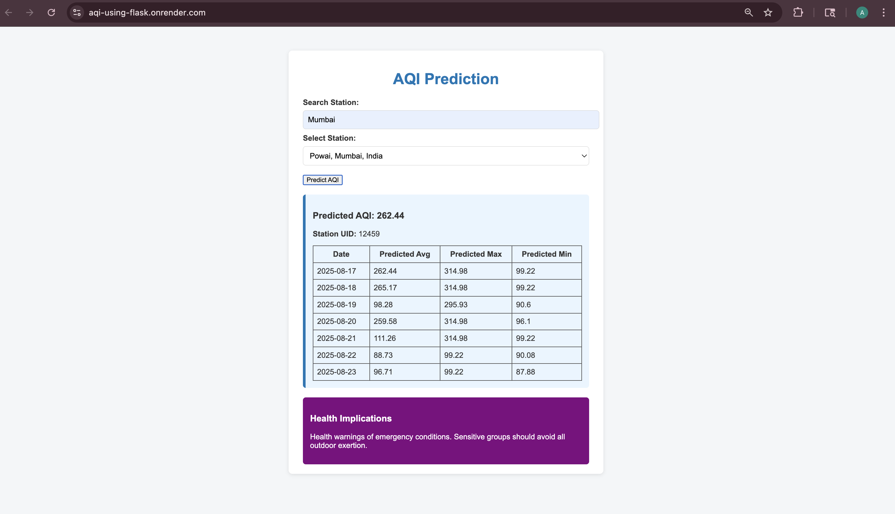
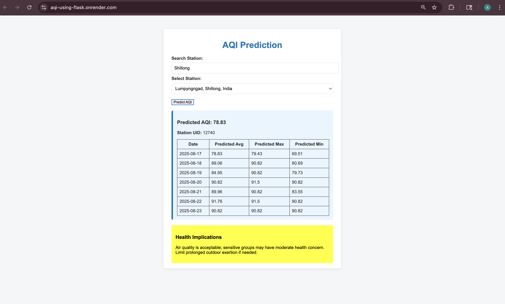

# Air Quality Index (AQI) Prediction Web Application 🌍

[Live Demo](https://aqi-using-flask.onrender.com/) | [GitHub Repo](https://github.com/AQI-BE-Project/AQI_using_flask)

## 📌 Project Overview
A machine learning-powered web application that predicts **daily and weekly Air Quality Index (AQI)** at **city and station levels** (user-selectable).  
The system combines **historical CPCB datasets** with **real-time WAQI API feeds**, and delivers AQI forecasts with **health implications** via an interactive Flask-based web app.

---

## 🚀 Features
- **Daily & Weekly AQI Forecasts** – Average, max, and min predictions.  
- **Health Impact Insights** – Color-coded descriptions aligned with WHO/CPCB standards.  
- **Interactive Web UI** – Built with Flask, HTML, and CSS; deployed on Render.  
- **Model Performance** – Achieved **R² = 0.87** with Random Forest regression.  
- **CI/CD Deployment** – Seamless model updates and production deployment.  

---

## 🛠️ Tech Stack
- **Languages**: Python, JavaScript, HTML/CSS  
- **Frameworks**: Flask, scikit-learn, Pandas, NumPy  
- **ML Model**: Random Forest Regressor (with cross-validation, feature engineering)  
- **APIs/Datasets**: WAQI API, CPCB Historical Data  
- **Deployment**: Render (CI/CD), Pickle serialization for model packaging  

---

## 📊 Model Performance
- **R² Score**: 0.87  
- **Validation**: MAE, RMSE, residual plots  
- **Cross-validation (k=5)**: Avg. score ≈ 0.69  
  *(Computed using sklearn’s cross_val_score with cv=5)*  

---

## 📂 System Architecture
1. **Data Ingestion**: Historical CPCB data + WAQI API for real-time updates  
2. **Preprocessing**: Cleaning, feature engineering (PM2.5, PM10, Ozone, etc.)  
3. **Model Training**: Random Forest regression with hyperparameter tuning  
4. **Deployment**: Model serialized as `.pickle`, served via Flask REST endpoints  
5. **UI Layer**: Web interface for query-based AQI prediction and visualization  

---

## 🖥️ Screenshots
### AQI Prediction UI





---

## 🔮 Future Improvements
- Experiment with Transformer-based time-series forecasting (Temporal Fusion Transformer, LSTMs)  
- Add geo-mapping & visualization with Plotly/D3.js  
- Extend to global AQI monitoring with multi-source APIs  
- Optimize for low-latency inference using ONNX or TensorRT 

## ⚡ Usage

```bash
git clone https://github.com/AQI-BE-Project/AQI_using_flask.git
cd AQI_using_flask
pip install -r requirements.txt

export WAQI_API_KEY=your_api_key_here   # macOS/Linux
set WAQI_API_KEY=your_api_key_here      # Windows PowerShell

export MODEL_PATH=your_model_path_here  # macOS/Linux
set MODEL_PATH=your_model_path_here     # Windows PowerShell

python app.py                          # Run app
# Access app at: http://127.0.0.1:5002/
```

## 👤 Author
**Aishwarya Joshi**  
📍 P.E.S's Modern College Of Engineering, Pune, MH, India (BE Computer Engineering, Aug 2020–June 2021)   
[LinkedIn](https://www.linkedin.com/in/aishwarya-j-822999188) | [GitHub](https://github.com/Aishwarya-Joshi11)
